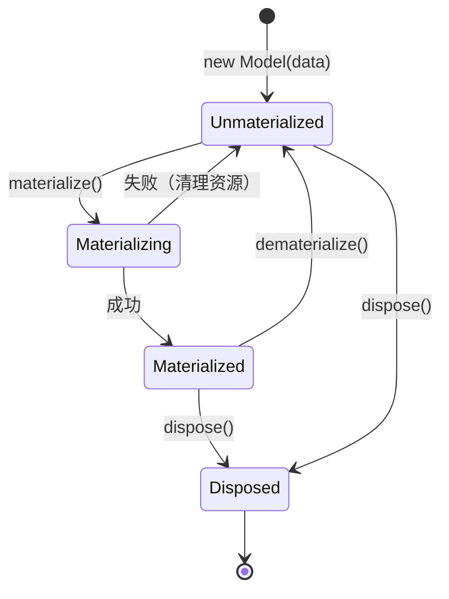
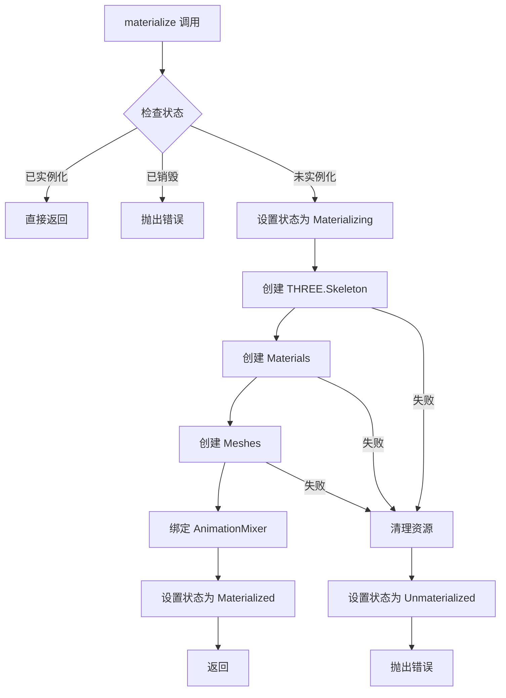

# 设计文档

## 概述

本设计文档描述了 Model 类延迟初始化重构的技术方案。核心思想是将 Model 类的生命周期分为两个阶段：
1. **数据阶段**：仅持有纯数据对象（ModelData、MeshData、MaterialData、SkeletonData）
2. **渲染阶段**：通过 `materialize()` 方法创建 Three.js 渲染对象

这种设计实现了数据层和渲染层的完全解耦，支持预加载、按需渲染和资源管理。

## 架构

### 状态机模型

Model 类采用状态机模式管理生命周期：



### 类图

```mermaid
classDiagram
    class Model {
        -_data: ModelData
        -_state: ModelState
        -_skeleton: Skeleton | null
        -_threeSkeleton: THREE.Skeleton | null
        -_materials: THREE.Material[]
        -_meshes: THREE.Mesh[]
        -_skinnedMeshes: THREE.SkinnedMesh[]
        -_animationMixer: AnimationMixer
        +modelName: string
        +data: ModelData
        +isMaterialized: boolean
        +isDisposed: boolean
        +canMaterialize: boolean
        +skeletonData: SkeletonData | null
        +materialDataList: MaterialData[]
        +meshDataList: MeshData[]
        +materialize(basePath: string): Promise~void~
        +dematerialize(): void
        +dispose(): void
    }
    
    class ModelState {
        <<enumeration>>
        Unmaterialized
        Materializing
        Materialized
        Disposed
    }
    
    class ModelData {
        +name: string
        +meshes: MeshData[]
        +materials: MaterialData[]
        +skeleton: SkeletonData | null
    }
    
    Model --> ModelState
    Model --> ModelData
    Model --> AnimationMixer


## 组件与接口

### ModelState 枚举

```typescript
/**
 * Model 状态枚举
 */
export enum ModelState {
  /** 未实例化：仅持有数据，未创建 GPU 资源 */
  Unmaterialized = 'unmaterialized',
  /** 实例化中：正在创建 GPU 资源 */
  Materializing = 'materializing',
  /** 已实例化：GPU 资源已创建，可以渲染 */
  Materialized = 'materialized',
  /** 已销毁：所有资源已释放，不可再使用 */
  Disposed = 'disposed'
}
```

### ModelNotMaterializedError 错误类

```typescript
/**
 * Model 未实例化错误
 * 当尝试访问需要实例化的功能时抛出
 */
export class ModelNotMaterializedError extends Error {
  constructor(operation: string) {
    super(`Cannot ${operation}: Model is not materialized. Call materialize() first.`)
    this.name = 'ModelNotMaterializedError'
  }
}
```

### Model 类核心接口

```typescript
export class Model extends THREE.Group {
  // ===== 私有状态 =====
  private _data: ModelData
  private _state: ModelState
  private _basePath: string | null
  
  // ===== 数据/逻辑层对象（构造时创建）=====
  private _skeleton: Skeleton | null  // 纯逻辑层，构造时从 SkeletonData 创建
  
  // ===== 渲染层对象（延迟创建）=====
  private _threeSkeleton: THREE.Skeleton | null  // GPU 资源，延迟创建
  private _materials: THREE.Material[]           // GPU 资源，延迟创建
  private _meshes: THREE.Mesh[]                  // GPU 资源，延迟创建
  private _skinnedMeshes: THREE.SkinnedMesh[]    // GPU 资源，延迟创建
  
  // ===== 构造函数 =====
  constructor(data: ModelData) {
    super()
    this._data = data
    this._state = ModelState.Unmaterialized
    this._basePath = null
    
    // 创建逻辑层对象（不涉及 GPU）
    if (data.skeleton) {
      this._skeleton = new Skeleton(data.skeleton)
    }
    
    // 不创建任何 GPU 资源
  }
  
  // ===== 状态查询 =====
  get isMaterialized(): boolean
  get isDisposed(): boolean
  get canMaterialize(): boolean
  
  // ===== 数据层访问 =====
  get data(): ModelData
  get skeletonData(): SkeletonData | null
  get materialDataList(): MaterialData[]
  get meshDataList(): MeshData[]
  
  // ===== 逻辑层访问（构造后即可用）=====
  get skeleton(): Skeleton | null  // 构造后即可访问
  
  // ===== 实例化控制 =====
  async materialize(basePath: string): Promise<void>
  dematerialize(): void
  dispose(): void
}
```

### materialize 方法实现流程



注意：`Skeleton`（逻辑层）在构造时已创建，`materialize` 只需要创建 `THREE.Skeleton`（GPU 资源）。

## 数据模型

### 状态转换规则

| 当前状态 | 操作 | 目标状态 | 说明 |
|---------|------|---------|------|
| Unmaterialized | materialize() | Materialized | 创建所有 GPU 资源 |
| Unmaterialized | dispose() | Disposed | 清除数据引用 |
| Materialized | dematerialize() | Unmaterialized | 释放 GPU 资源，保留数据 |
| Materialized | dispose() | Disposed | 释放所有资源 |
| Materializing | 成功 | Materialized | 内部状态转换 |
| Materializing | 失败 | Unmaterialized | 回滚并清理 |
| Disposed | 任何操作 | 抛出错误 | 不可恢复状态 |

### 属性访问规则

| 属性/方法 | Unmaterialized | Materialized | Disposed |
|----------|----------------|--------------|----------|
| modelName | ✓ | ✓ | ✗ |
| data | ✓ | ✓ | ✗ |
| skeletonData | ✓ | ✓ | ✗ |
| materialDataList | ✓ | ✓ | ✗ |
| meshDataList | ✓ | ✓ | ✗ |
| skeleton | ✓ (逻辑层) | ✓ | ✗ |
| threeSkeleton | null | THREE.Skeleton | ✗ |
| materials | [] | THREE.Material[] | ✗ |
| meshes | [] | THREE.Mesh[] | ✗ |
| update() | 无操作 | 更新动画 | ✗ |
| playAnimation() | 抛出错误 | ✓ | ✗ |
| getBoneByName() | ✓ (通过 Skeleton) | ✓ | ✗ |
| getBoneWorldPosition() | 抛出错误 | ✓ | ✗ |


## 正确性属性

*正确性属性是一种应该在系统所有有效执行中保持为真的特征或行为——本质上是关于系统应该做什么的形式化陈述。属性作为人类可读规范和机器可验证正确性保证之间的桥梁。*

### Property 1: 构造时不创建 GPU 资源

*对于任意* ModelData（包含任意数量的 MeshData、MaterialData 和可选的 SkeletonData），使用该 ModelData 构造 Model 后，所有 GPU 相关属性（threeSkeleton、materials、meshes、skinnedMeshes）应该为 null 或空数组。但逻辑层对象 skeleton（如果有 SkeletonData）应该已创建。

**验证需求: 1.1, 3.1, 4.1, 5.1**

### Property 2: 未实例化时数据层可访问

*对于任意* 未实例化的 Model，访问数据层属性（modelName、data、skeletonData、materialDataList、meshDataList）应该返回与构造时传入的 ModelData 一致的值，不抛出任何错误。

**验证需求: 1.3, 3.3, 4.3, 5.3**

### Property 3: 未实例化时渲染层返回空

*对于任意* 未实例化的 Model，访问渲染层属性时，materials 和 meshes 应该返回空数组，skeleton 和 threeSkeleton 应该返回 null。

**验证需求: 1.4**

### Property 4: materialize 创建所有 GPU 资源

*对于任意* 包含有效数据的 ModelData，调用 materialize 后，如果 ModelData 包含 SkeletonData 则 threeSkeleton 不为 null（skeleton 在构造时已创建），materials 数组长度等于 MaterialData 数组长度，meshes 和 skinnedMeshes 的总数等于 MeshData 数组长度。

**验证需求: 2.1, 2.2, 3.2, 4.2, 5.2**

### Property 5: materialize 幂等性

*对于任意* Model，多次调用 materialize 应该与调用一次的效果相同，不会创建重复的资源，后续调用应该立即返回。

**验证需求: 2.3**

### Property 6: dematerialize 释放资源并保留数据

*对于任意* 已实例化的 Model，调用 dematerialize 后，isMaterialized 应该为 false，所有 GPU 资源应该被释放（materials、meshes 为空），但 data 属性应该保持不变，且可以再次调用 materialize 重新实例化。

**验证需求: 2.5, 7.3**

### Property 7: 动画系统兼容性

*对于任意* Model 和 AnimationClip，在 Model 未实例化时加载动画应该成功，在 materialize 后 AnimationMixer 应该自动绑定到新创建的 Skeleton。

**验证需求: 6.1, 6.2, 6.4**

### Property 8: 未实例化时播放动画抛出错误

*对于任意* 未实例化的 Model，调用 playAnimation 应该抛出 ModelNotMaterializedError。

**验证需求: 6.3**

### Property 9: dispose 释放所有资源

*对于任意* Model（无论是否已实例化），调用 dispose 后，isDisposed 应该为 true，所有资源引用应该被清除，任何后续操作应该抛出错误。

**验证需求: 7.1, 7.2, 7.4**

### Property 10: 状态查询属性正确性

*对于任意* Model，在不同状态下：
- 构造后：isMaterialized = false, isDisposed = false, canMaterialize = true
- materialize 后：isMaterialized = true, isDisposed = false, canMaterialize = false
- dematerialize 后：isMaterialized = false, isDisposed = false, canMaterialize = true
- dispose 后：isMaterialized = false, isDisposed = true, canMaterialize = false

**验证需求: 1.2, 8.1, 8.2, 8.3**

### Property 11: 未实例化时访问渲染方法抛出错误

*对于任意* 未实例化的 Model，调用需要实例化的方法（如 setWireframe、setCastShadow、getBoneWorldPosition 等）应该抛出 ModelNotMaterializedError。

**验证需求: 8.4**

## 错误处理

### 错误类型

| 错误类 | 触发条件 | 处理方式 |
|-------|---------|---------|
| ModelNotMaterializedError | 未实例化时访问渲染功能 | 提示用户先调用 materialize() |
| ModelDisposedError | 已销毁后进行任何操作 | 提示模型已销毁，不可再使用 |
| ModelLoadError | materialize 过程中加载资源失败 | 清理已创建资源，恢复到未实例化状态 |

### 错误恢复策略

```typescript
async materialize(basePath: string): Promise<void> {
  if (this._state === ModelState.Disposed) {
    throw new ModelDisposedError()
  }
  if (this._state === ModelState.Materialized) {
    return // 幂等性：已实例化则直接返回
  }
  
  this._state = ModelState.Materializing
  this._basePath = basePath
  
  try {
    // 按顺序创建资源
    await this.createSkeleton()
    await this.createMaterials()
    await this.createMeshes()
    this.bindAnimationMixer()
    
    this._state = ModelState.Materialized
  } catch (error) {
    // 清理已创建的资源
    this.cleanupPartialResources()
    this._state = ModelState.Unmaterialized
    throw error
  }
}
```

## 测试策略

### 单元测试

单元测试用于验证特定示例和边界情况：

1. **状态转换测试**
   - 测试从 Unmaterialized 到 Materialized 的转换
   - 测试从 Materialized 到 Unmaterialized 的转换（dematerialize）
   - 测试 dispose 后的状态

2. **边界情况测试**
   - 空 ModelData（无网格、无材质、无骨骼）
   - 仅有骨骼无网格的模型
   - 多材质网格

3. **错误处理测试**
   - materialize 失败时的资源清理
   - dispose 后的操作拒绝

### 属性测试

属性测试用于验证普遍属性，每个测试至少运行 100 次迭代：

1. **Property 1 测试**: 生成随机 ModelData，验证构造后 GPU 资源为空
2. **Property 5 测试**: 生成随机 Model，多次调用 materialize，验证幂等性
3. **Property 6 测试**: 生成随机已实例化 Model，dematerialize 后验证可重新实例化
4. **Property 11 测试**: 生成随机 Model，在各状态下验证状态查询属性

### 测试框架

- 使用 Vitest 作为测试框架
- 使用 fast-check 进行属性测试
- 每个属性测试标注对应的设计文档属性编号

```typescript
// 示例：Property 1 测试
describe('Model Lazy Initialization', () => {
  // Feature: model-lazy-initialization, Property 1: 构造时不创建 GPU 资源
  it.prop([modelDataArbitrary])('should not create GPU resources on construction', (modelData) => {
    const model = new Model(modelData)
    
    expect(model.skeleton).toBeNull()
    expect(model.threeSkeleton).toBeNull()
    expect(model.materials).toHaveLength(0)
    expect(model.meshes).toHaveLength(0)
    expect(model.skinnedMeshes).toHaveLength(0)
  })
})
```
