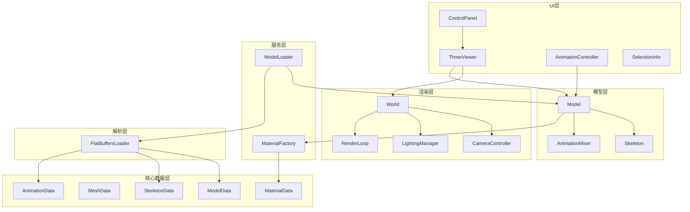
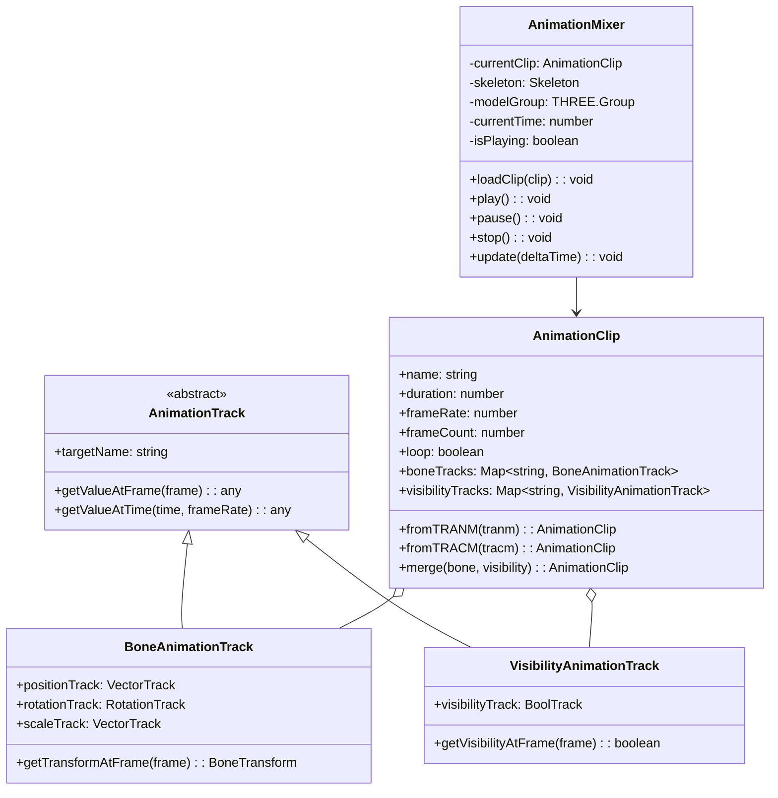
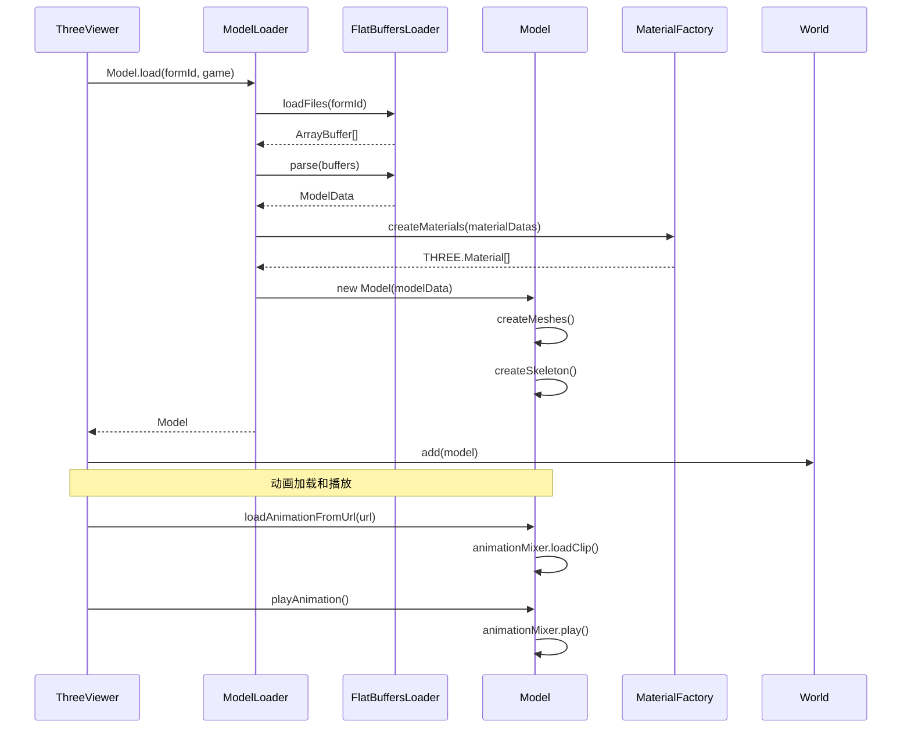

# 设计文档

## 概述

本设计文档描述宝可梦模型渲染项目的重构架构。重构采用分层架构，将系统分为核心数据层、服务层、渲染层和UI层。核心设计原则是数据与渲染分离，通过通用数据模型支持未来扩展。

## 架构

### 整体架构图



### 目录结构

```
web/src/
├── core/                      # 核心层
│   ├── data/                  # 纯数据模型
│   │   ├── ModelData.ts
│   │   ├── MeshData.ts
│   │   ├── MaterialData.ts
│   │   ├── SkeletonData.ts
│   │   ├── AnimationData.ts
│   │   └── index.ts
│   ├── model/                 # Model整合类
│   │   ├── Model.ts
│   │   └── index.ts
│   ├── skeleton/              # 骨骼系统
│   │   ├── Bone.ts
│   │   ├── Skeleton.ts
│   │   └── index.ts
│   └── animation/             # 动画系统
│       ├── AnimationClip.ts
│       ├── AnimationTrack.ts
│       ├── BoneAnimationTrack.ts
│       ├── VisibilityAnimationTrack.ts
│       ├── AnimationMixer.ts
│       └── index.ts
├── loaders/                   # 解析层
│   ├── FlatBuffersLoader.ts
│   ├── ModelLoader.ts
│   └── index.ts
├── materials/                 # 材质系统
│   ├── MaterialFactory.ts
│   ├── DefaultMaterial.ts
│   ├── EyeClearCoatMaterial.ts
│   ├── FireMaterial.ts
│   ├── NonDirectionalMaterial.ts
│   ├── IkCharacterMaterial.ts
│   └── index.ts
├── rendering/                 # 渲染层
│   ├── World.ts
│   ├── CameraController.ts
│   ├── LightingManager.ts
│   ├── RenderLoop.ts
│   ├── SceneHelpers.ts
│   └── index.ts
├── components/                # UI层
│   ├── ThreeViewer.vue
│   ├── ControlPanel.vue
│   ├── AnimationController.vue
│   ├── SelectionInfoPanel.vue
│   ├── LoadingOverlay.vue
│   ├── ErrorDisplay.vue
│   └── PokemonBrowser.vue
├── composables/               # Vue组合式函数
│   ├── useWorld.ts
│   ├── useModelLoader.ts
│   └── usePokemonDatas.ts
├── parsers/                   # FlatBuffers生成代码（保持不变）
│   └── generated/
├── types/
│   └── index.ts
└── utils/
    ├── mathUtils.ts
    ├── textureMapping.ts
    └── pokemonPath.ts
```

## 组件和接口

### 核心数据模型

#### ModelData（纯数据）

```typescript
interface IModelData {
  readonly name: string;
  readonly meshes: IMeshData[];
  readonly materials: IMaterialData[];
  readonly skeleton: ISkeletonData | null;
}

class ModelData implements IModelData {
  constructor(
    public readonly name: string,
    public readonly meshes: MeshData[],
    public readonly materials: MaterialData[],
    public readonly skeleton: SkeletonData | null
  ) {}
  
  static fromFlatBuffers(
    trmdl: TRMDL,
    trmsh: TRMSH,
    trmbf: TRMBF,
    trmtr?: TRMTR,
    trskl?: TRSKL
  ): ModelData;
}
```

### Model类（整合管理）

`Model` 类是模型的整体封装，整合管理 Animation、Material、Skeleton 等组件，提供统一的接口。

```typescript
class Model extends THREE.Group {
  readonly name: string;
  readonly data: ModelData;
  
  // 组件
  private _skeleton: Skeleton | null;
  private _animationMixer: AnimationMixer;
  private _materials: THREE.Material[];
  private _meshes: THREE.Mesh[];
  
  // Three.js对象
  private _threeSkeleton: THREE.Skeleton | null;
  private _skinnedMeshes: THREE.SkinnedMesh[];
  
  constructor(data: ModelData);
  
  // ===== 骨骼相关 =====
  get skeleton(): Skeleton | null;
  get threeSkeleton(): THREE.Skeleton | null;
  
  getBoneByName(name: string): Bone | null;
  getBoneByIndex(index: number): Bone | null;
  getBoneWorldPosition(boneName: string): THREE.Vector3 | null;
  getBoneWorldMatrix(boneName: string): THREE.Matrix4 | null;
  
  // ===== 动画相关 =====
  get animationMixer(): AnimationMixer;
  
  loadAnimation(clip: AnimationClip): void;
  loadAnimationFromUrl(url: string): Promise<void>;
  
  playAnimation(name?: string): void;
  pauseAnimation(): void;
  stopAnimation(): void;
  
  setAnimationLoop(loop: boolean): void;
  setAnimationTime(time: number): void;
  getAnimationState(): AnimationState;
  
  // ===== 材质相关 =====
  get materials(): THREE.Material[];
  
  getMaterialByName(name: string): THREE.Material | null;
  getMaterialByIndex(index: number): THREE.Material | null;
  setMaterialVisible(name: string, visible: boolean): void;
  
  // ===== 网格相关 =====
  get meshes(): THREE.Mesh[];
  
  getMeshByName(name: string): THREE.Mesh | null;
  setMeshVisible(name: string, visible: boolean): void;
  
  // ===== 渲染控制 =====
  setWireframe(enabled: boolean): void;
  setCastShadow(enabled: boolean): void;
  setReceiveShadow(enabled: boolean): void;
  
  // ===== 包围盒 =====
  getBoundingBox(): THREE.Box3;
  getBoundingSphere(): THREE.Sphere;
  getCenter(): THREE.Vector3;
  getSize(): THREE.Vector3;
  
  // ===== 更新和销毁 =====
  update(deltaTime: number): void;  // 更新动画等
  dispose(): void;  // 释放所有资源
  
  // ===== 工厂方法 =====
  static async fromModelData(
    data: ModelData,
    basePath: string
  ): Promise<Model>;
  
  static async load(
    formId: string,
    game: Game
  ): Promise<Model>;
}
```

#### MeshData

```typescript
interface IMeshData {
  readonly name: string;
  readonly positions: Float32Array;
  readonly normals: Float32Array | null;
  readonly uvs: Float32Array | null;
  readonly uvs2: Float32Array | null;
  readonly tangents: Float32Array | null;
  readonly colors: Float32Array | null;
  readonly skinIndices: Float32Array | null;
  readonly skinWeights: Float32Array | null;
  readonly indices: Uint16Array | Uint32Array;
  readonly groups: MeshGroup[];
}

interface MeshGroup {
  start: number;
  count: number;
  materialIndex: number;
  materialName: string | null;
}

class MeshData implements IMeshData {
  toBufferGeometry(): THREE.BufferGeometry;
}
```

#### MaterialData

```typescript
interface IMaterialData {
  readonly name: string;
  readonly shaderName: string | null;
  readonly textures: TextureReference[];
  readonly floatParams: Map<string, number>;
  readonly colorParams: Map<string, THREE.Vector4>;
  readonly alphaType: string | null;
  readonly samplers: SamplerData[];
}

interface TextureReference {
  name: string;
  filename: string;
  slot: number;
  type: TextureType;
}

interface SamplerData {
  wrapU: UVWrapMode;
  wrapV: UVWrapMode;
}

type TextureType = 'albedo' | 'normal' | 'emission' | 'roughness' | 
                   'metalness' | 'ao' | 'mask' | 'region' | 'unknown';
```

#### SkeletonData

```typescript
interface ISkeletonData {
  readonly bones: BoneData[];
  readonly boneCount: number;
}

interface BoneData {
  readonly index: number;
  readonly name: string;
  readonly parentIndex: number;
  readonly localPosition: THREE.Vector3;
  readonly localRotation: THREE.Euler;
  readonly localScale: THREE.Vector3;
}

class SkeletonData implements ISkeletonData {
  getBoneByName(name: string): BoneData | null;
  getBoneByIndex(index: number): BoneData | null;
  toThreeSkeleton(): THREE.Skeleton;
}
```

#### AnimationData

```typescript
interface IAnimationData {
  readonly name: string;
  readonly duration: number;
  readonly frameRate: number;
  readonly frameCount: number;
  readonly loop: boolean;
  readonly tracks: AnimationTrackData[];
}

interface AnimationTrackData {
  readonly type: 'bone' | 'visibility' | 'material';
  readonly targetName: string;
}

interface BoneTrackData extends AnimationTrackData {
  readonly type: 'bone';
  readonly positionTrack: VectorTrackData | null;
  readonly rotationTrack: RotationTrackData | null;
  readonly scaleTrack: VectorTrackData | null;
}

interface VisibilityTrackData extends AnimationTrackData {
  readonly type: 'visibility';
  readonly visibilityTrack: BoolTrackData;
}
```

### 骨骼系统

#### Bone

```typescript
class Bone {
  readonly index: number;
  readonly name: string;
  parent: Bone | null;
  children: Bone[];
  
  localPosition: THREE.Vector3;
  localRotation: THREE.Quaternion;
  localScale: THREE.Vector3;
  
  private _localMatrix: THREE.Matrix4;
  private _worldMatrix: THREE.Matrix4;
  private _inverseBindMatrix: THREE.Matrix4;
  
  constructor(data: BoneData);
  
  get localMatrix(): THREE.Matrix4;
  get worldMatrix(): THREE.Matrix4;
  get inverseBindMatrix(): THREE.Matrix4;
  
  updateLocalMatrix(): void;
  updateWorldMatrix(parentWorldMatrix?: THREE.Matrix4): void;
  computeInverseBindMatrix(): void;
  
  setLocalTransform(position: THREE.Vector3, rotation: THREE.Quaternion, scale: THREE.Vector3): void;
}
```

#### Skeleton

```typescript
class Skeleton {
  readonly bones: Bone[];
  readonly rootBones: Bone[];
  private boneMap: Map<string, Bone>;
  
  constructor(data: SkeletonData);
  
  getBoneByName(name: string): Bone | null;
  getBoneByIndex(index: number): Bone | null;
  
  updateWorldMatrices(): void;
  computeInverseBindMatrices(): void;
  
  traverse(callback: (bone: Bone) => void): void;
  
  toThreeSkeleton(): THREE.Skeleton;
  toThreeBoneGroup(): THREE.Group;  // 用于可视化
}
```

### 动画系统

动画系统负责管理和播放骨骼动画、可见性动画，并预留材质动画扩展。

#### 设计理念

- **AnimationClip**: 表示一个动画片段的数据，包含所有轨道信息，是纯数据对象
- **AnimationMixer**: 动画播放器，负责根据时间更新骨骼和网格状态，是有状态的控制器
- **AnimationTrack**: 单个属性的动画轨道，负责在指定时间点计算属性值



#### AnimationTrack (基类)

AnimationTrack 是所有动画轨道的抽象基类，定义了获取指定时间点属性值的接口。

```typescript
abstract class AnimationTrack {
  readonly targetName: string;  // 目标对象名称（骨骼名或网格名）
  
  abstract getValueAtFrame(frame: number): any;
  abstract getValueAtTime(time: number, frameRate: number): any;
}
```

#### BoneAnimationTrack

骨骼动画轨道，包含位置、旋转、缩放三个子轨道。每个子轨道可以是不同类型（固定值、动态数组、关键帧）。

```typescript
class BoneAnimationTrack extends AnimationTrack {
  readonly positionTrack: VectorTrack | null;   // 位置轨道
  readonly rotationTrack: RotationTrack | null; // 旋转轨道（四元数）
  readonly scaleTrack: VectorTrack | null;      // 缩放轨道
  
  constructor(
    targetName: string,
    positionTrack: VectorTrack | null,
    rotationTrack: RotationTrack | null,
    scaleTrack: VectorTrack | null
  );
  
  // 获取指定帧的完整变换
  getTransformAtFrame(frame: number): BoneTransform;
  
  // 获取指定时间的完整变换（会进行帧间插值）
  getTransformAtTime(time: number, frameRate: number): BoneTransform;
}

interface BoneTransform {
  position: THREE.Vector3;
  rotation: THREE.Quaternion;
  scale: THREE.Vector3;
}

// 向量轨道类型（位置、缩放使用）
type VectorTrack = 
  | FixedVectorTrack      // 固定值，整个动画期间不变
  | DynamicVectorTrack    // 每帧一个值的数组
  | Framed16VectorTrack   // 关键帧（16位帧索引）
  | Framed8VectorTrack;   // 关键帧（8位帧索引）

// 旋转轨道类型
type RotationTrack = 
  | FixedRotationTrack    // 固定旋转
  | DynamicRotationTrack  // 每帧一个旋转
  | Framed16RotationTrack // 关键帧旋转
  | Framed8RotationTrack; // 关键帧旋转
```

#### VisibilityAnimationTrack

可见性动画轨道，控制网格的显示/隐藏。

```typescript
class VisibilityAnimationTrack extends AnimationTrack {
  readonly visibilityTrack: BoolTrack;  // 布尔值轨道
  
  constructor(targetName: string, visibilityTrack: BoolTrack);
  
  getVisibilityAtFrame(frame: number): boolean;
  getVisibilityAtTime(time: number, frameRate: number): boolean;
}

// 布尔轨道类型
type BoolTrack = 
  | FixedBoolTrack     // 固定值
  | DynamicBoolTrack   // 每帧一个值
  | Framed16BoolTrack  // 关键帧
  | Framed8BoolTrack;  // 关键帧
```

#### AnimationClip

AnimationClip 是一个动画片段的完整数据，包含所有骨骼轨道和可见性轨道。它是纯数据对象，不包含播放状态。

```typescript
class AnimationClip {
  readonly name: string;           // 动画名称
  readonly duration: number;       // 持续时间（秒）
  readonly frameRate: number;      // 帧率（如30fps）
  readonly frameCount: number;     // 总帧数
  readonly loop: boolean;          // 是否循环
  
  // 骨骼动画轨道，key是骨骼名称
  readonly boneTracks: Map<string, BoneAnimationTrack>;
  
  // 可见性动画轨道，key是网格名称
  readonly visibilityTracks: Map<string, VisibilityAnimationTrack>;
  
  constructor(data: IAnimationData);
  
  // 从TRANM文件创建（骨骼动画）
  static fromTRANM(tranm: TRANM): AnimationClip;
  
  // 从TRACM文件创建（可见性动画）
  static fromTRACM(tracm: TRACM): AnimationClip;
  
  // 合并骨骼动画和可见性动画
  static merge(boneClip: AnimationClip, visibilityClip: AnimationClip): AnimationClip;
  
  // 获取指定骨骼在指定帧的变换
  getBoneTransformAtFrame(boneName: string, frame: number): BoneTransform | null;
  
  // 获取指定网格在指定帧的可见性
  getVisibilityAtFrame(meshName: string, frame: number): boolean;
}
```

#### AnimationMixer

AnimationMixer 是动画播放控制器，负责：
1. 管理当前播放的动画片段
2. 维护播放状态（时间、帧、播放/暂停）
3. 在每帧更新时计算并应用骨骼变换和网格可见性

```typescript
class AnimationMixer {
  private currentClip: AnimationClip | null;  // 当前动画片段
  private skeleton: Skeleton | null;          // 目标骨骼
  private modelGroup: THREE.Group | null;     // 目标模型组（用于可见性）
  
  // 播放状态
  private currentTime: number;    // 当前时间（秒）
  private currentFrame: number;   // 当前帧
  private isPlaying: boolean;     // 是否正在播放
  private loop: boolean;          // 是否循环
  
  constructor();
  
  // 设置目标骨骼（用于骨骼动画）
  setSkeleton(skeleton: Skeleton): void;
  
  // 设置目标模型组（用于可见性动画）
  setModelGroup(group: THREE.Group): void;
  
  // 加载动画片段
  loadClip(clip: AnimationClip): void;
  
  // 播放控制
  play(): void;   // 开始/继续播放
  pause(): void;  // 暂停（保持当前时间）
  stop(): void;   // 停止（重置到开始）
  
  // 设置
  setLoop(loop: boolean): void;
  setTime(time: number): void;  // 跳转到指定时间
  
  // 核心更新方法 - 每帧调用
  update(deltaTime: number): void;
  
  // 获取当前状态
  getState(): AnimationState;
  
  // 释放资源
  dispose(): void;
}

interface AnimationState {
  currentTime: number;
  duration: number;
  currentFrame: number;
  frameCount: number;
  isPlaying: boolean;
  loop: boolean;
}
```

#### AnimationMixer.update() 工作流程

```typescript
update(deltaTime: number): void {
  if (!this.isPlaying || !this.currentClip) return;
  
  // 1. 更新时间
  this.currentTime += deltaTime;
  
  // 2. 处理循环/结束
  if (this.currentTime >= this.currentClip.duration) {
    if (this.loop) {
      this.currentTime = this.currentTime % this.currentClip.duration;
    } else {
      this.currentTime = this.currentClip.duration;
      this.isPlaying = false;
    }
  }
  
  // 3. 计算当前帧
  this.currentFrame = Math.floor(
    this.currentTime * this.currentClip.frameRate
  );
  
  // 4. 更新骨骼变换
  if (this.skeleton) {
    for (const [boneName, track] of this.currentClip.boneTracks) {
      const bone = this.skeleton.getBoneByName(boneName);
      if (bone) {
        const transform = track.getTransformAtFrame(this.currentFrame);
        bone.setLocalTransform(
          transform.position,
          transform.rotation,
          transform.scale
        );
      }
    }
    this.skeleton.updateWorldMatrices();
  }
  
  // 5. 更新网格可见性
  if (this.modelGroup) {
    for (const [meshName, track] of this.currentClip.visibilityTracks) {
      const mesh = this.findMeshByName(meshName);
      if (mesh) {
        mesh.visible = track.getVisibilityAtFrame(this.currentFrame);
      }
    }
  }
}
```

#### 使用示例

```typescript
// 1. 加载动画文件
const tranmBuffer = await loadBinaryResource('/SCVI/pm0001/pm0001_00_00/idle.tranm');
const tracmBuffer = await loadBinaryResource('/SCVI/pm0001/pm0001_00_00/idle.tracm');

// 2. 解析为AnimationClip
const boneClip = AnimationClip.fromTRANM(parseTRANM(tranmBuffer));
const visibilityClip = AnimationClip.fromTRACM(parseTRACM(tracmBuffer));

// 3. 合并动画
const clip = AnimationClip.merge(boneClip, visibilityClip);

// 4. 通过Model播放（推荐方式）
const model = await Model.load('pm0001_00_00', 'SCVI');
model.loadAnimation(clip);
model.playAnimation();

// 5. 在渲染循环中更新
function animate() {
  const deltaTime = clock.getDelta();
  model.update(deltaTime);  // 内部调用 animationMixer.update()
  renderer.render(scene, camera);
  requestAnimationFrame(animate);
}
```

### 材质系统

#### MaterialFactory

```typescript
type MaterialCreator = (
  data: MaterialData,
  basePath: string,
  textureMap: Map<string, THREE.Texture>
) => THREE.Material;

class MaterialFactory {
  private static creators: Map<string, MaterialCreator> = new Map();
  
  static register(shaderName: string, creator: MaterialCreator): void;
  static unregister(shaderName: string): void;
  
  static async create(
    data: MaterialData,
    basePath: string
  ): Promise<THREE.Material>;
  
  static createDefault(options?: MaterialOptions): THREE.MeshStandardMaterial;
}

// 注册具体材质
MaterialFactory.register('EyeClearCoat', createEyeClearCoatMaterial);
MaterialFactory.register('Eye', createEyeClearCoatMaterial);
MaterialFactory.register('Unlit', createFireMaterial);
MaterialFactory.register('NonDirectional', createNonDirectionalMaterial);
MaterialFactory.register('IkCharacter', createIkCharacterMaterial);
```

#### 具体材质实现模式

```typescript
// 所有具体材质使用onBeforeCompile方式，保持顶点shader不变
function createEyeClearCoatMaterial(
  data: MaterialData,
  basePath: string,
  textureMap: Map<string, THREE.Texture>
): THREE.MeshStandardMaterial {
  const material = new THREE.MeshStandardMaterial({
    side: THREE.DoubleSide,
  });
  
  // 存储自定义参数
  material.userData.eyeClearCoatParams = {
    baseColorLayer1: data.colorParams.get('BaseColorLayer1'),
    // ...
  };
  
  // 使用onBeforeCompile修改fragment shader
  material.onBeforeCompile = (shader) => {
    // 添加uniforms
    shader.uniforms.layerMaskMap = { value: textureMap.get('LayerMaskMap') };
    // ...
    
    // 修改fragment shader，保持vertex shader不变
    shader.fragmentShader = shader.fragmentShader.replace(
      '#include <common>',
      '#include <common>\n' + uniformDeclarations
    );
    // ...
  };
  
  return material;
}
```

### 渲染层

#### World

```typescript
class World {
  readonly scene: THREE.Scene;
  readonly camera: CameraController;
  readonly lighting: LightingManager;
  readonly renderLoop: RenderLoop;
  
  private helpers: THREE.Group;
  
  constructor(container: HTMLElement);
  
  add(object: THREE.Object3D): void;
  remove(object: THREE.Object3D): void;
  
  setHelpersVisible(visible: boolean): void;
  
  raycast(mouse: THREE.Vector2, objects: THREE.Object3D[]): THREE.Intersection[];
  
  resize(): void;
  dispose(): void;
}
```

#### CameraController

```typescript
class CameraController {
  readonly camera: THREE.PerspectiveCamera;
  readonly controls: OrbitControls;
  
  constructor(container: HTMLElement);
  
  fitToModel(model: THREE.Object3D): void;
  setPosition(x: number, y: number, z: number): void;
  setTarget(x: number, y: number, z: number): void;
  
  update(): void;
  dispose(): void;
}
```

#### LightingManager

```typescript
class LightingManager {
  readonly ambientLight: THREE.AmbientLight;
  readonly directionalLight: THREE.DirectionalLight;
  readonly environmentMap: THREE.CubeTexture | null;
  
  constructor(scene: THREE.Scene);
  
  setAmbientIntensity(intensity: number): void;
  setDirectionalIntensity(intensity: number): void;
  setEnvironmentIntensity(intensity: number): void;
  
  dispose(): void;
}
```

#### RenderLoop

```typescript
class RenderLoop {
  private renderer: THREE.WebGLRenderer;
  private scene: THREE.Scene;
  private camera: THREE.PerspectiveCamera;
  private animationId: number | null;
  private callbacks: Set<(deltaTime: number) => void>;
  
  constructor(
    container: HTMLElement,
    scene: THREE.Scene,
    camera: THREE.PerspectiveCamera
  );
  
  addCallback(callback: (deltaTime: number) => void): void;
  removeCallback(callback: (deltaTime: number) => void): void;
  
  start(): void;
  stop(): void;
  
  resize(width: number, height: number): void;
  dispose(): void;
}
```

## 数据模型

### 数据流图



### 类型定义

```typescript
// 向量轨道类型
interface VectorTrack {
  type: 'fixed' | 'dynamic' | 'framed16' | 'framed8';
  getValue(frame: number): THREE.Vector3;
}

// 旋转轨道类型
interface RotationTrack {
  type: 'fixed' | 'dynamic' | 'framed16' | 'framed8';
  getValue(frame: number): THREE.Quaternion;
}

// 布尔轨道类型
interface BoolTrack {
  type: 'fixed' | 'dynamic' | 'framed16' | 'framed8';
  getValue(frame: number): boolean;
}

// 材质选项
interface MaterialOptions {
  transparent?: boolean;
  doubleSide?: boolean;
  emissiveColor?: THREE.Color;
  emissiveIntensity?: number;
}

// 游戏类型
type Game = 'SCVI' | 'LZA';
```


## 正确性属性

*正确性属性是系统在所有有效执行中应保持为真的特征或行为——本质上是关于系统应该做什么的形式化陈述。属性作为人类可读规范和机器可验证正确性保证之间的桥梁。*

### Property 1: FlatBuffers数据转换完整性

*对于任意* 有效的FlatBuffers模型数据（TRMDL、TRMSH、TRMBF），转换为ModelData后，网格数量、顶点数量和索引数量应与原始数据一致。

**验证: 需求 1.6**

### Property 2: 骨骼局部变换存储正确性

*对于任意* 骨骼和任意局部变换（位置、旋转、缩放），设置后读取应返回相同的值。

**验证: 需求 2.3**

### Property 3: 骨骼世界矩阵计算正确性

*对于任意* 骨骼层次结构，子骨骼的世界矩阵应等于父骨骼世界矩阵乘以子骨骼局部矩阵。

**验证: 需求 2.4**

### Property 4: 逆绑定矩阵正确性

*对于任意* 骨骼，逆绑定矩阵乘以世界矩阵应等于单位矩阵（在数值精度范围内）。

**验证: 需求 2.5**

### Property 5: 骨骼查找一致性

*对于任意* 骨骼集合，通过名称查找和通过索引查找同一骨骼应返回相同的骨骼对象。

**验证: 需求 2.6**

### Property 6: 骨骼遍历完整性

*对于任意* 骨骼层次结构，遍历操作应访问所有骨骼恰好一次，且访问顺序应保证父骨骼在子骨骼之前被访问。

**验证: 需求 2.7**

### Property 7: SkeletonData到Three.js转换一致性

*对于任意* SkeletonData，转换为Three.js Skeleton后，骨骼数量应相等，且每个骨骼的名称和父子关系应保持一致。

**验证: 需求 2.8**

### Property 8: 动画状态机正确性

*对于任意* 动画播放器状态序列（播放、暂停、停止），状态转换应符合预期：
- 播放后isPlaying为true
- 暂停后isPlaying为false但时间保持
- 停止后isPlaying为false且时间重置为0

**验证: 需求 3.7**

### Property 9: 动画帧插值正确性

*对于任意* 两个关键帧之间的时间点t，插值结果应在两个关键帧值之间，且当t等于关键帧时间时应返回精确的关键帧值。

**验证: 需求 3.8**

### Property 10: 四元数打包解包往返一致性

*对于任意* 有效的四元数（归一化），打包为48位格式后解包应得到近似相等的四元数（在精度损失范围内）。

**验证: 需求 3.10**

### Property 11: 材质工厂策略正确性

*对于任意* 已注册的shader类型，MaterialFactory应返回对应的具体材质；对于未注册的shader类型，应返回默认材质。

**验证: 需求 4.3, 4.4**

### Property 12: 材质参数读取正确性

*对于任意* MaterialData中存储的浮点参数和颜色参数，读取工具函数应返回正确的值；对于不存在的参数应返回默认值。

**验证: 需求 4.10**

### Property 13: UV变换应用正确性

*对于任意* UV缩放和偏移参数，应用到纹理后，纹理的repeat和offset属性应与参数值一致。

**验证: 需求 4.11**

## 错误处理

### 文件加载错误

| 错误类型 | 处理策略 | 用户反馈 |
|---------|---------|---------|
| 文件不存在 | 抛出ModelLoadError | 显示"文件未找到"提示 |
| 网络错误 | 抛出ModelLoadError | 显示重试选项 |
| 解析错误 | 抛出ModelLoadError | 显示"格式错误"提示 |

### 材质加载错误

| 错误类型 | 处理策略 | 用户反馈 |
|---------|---------|---------|
| 纹理加载失败 | 使用默认材质 | 控制台警告 |
| Shader类型未知 | 使用默认材质 | 控制台警告 |
| 参数缺失 | 使用默认值 | 无 |

### 动画加载错误

| 错误类型 | 处理策略 | 用户反馈 |
|---------|---------|---------|
| 动画文件不存在 | 跳过该动画 | 控制台警告 |
| 解析错误 | 跳过该动画 | 控制台警告 |
| 骨骼不匹配 | 忽略不匹配的轨道 | 控制台警告 |

### 错误日志格式

```typescript
interface ErrorLog {
  timestamp: string;
  level: 'error' | 'warn' | 'info';
  module: string;
  message: string;
  context?: Record<string, unknown>;
  stack?: string;
}

// 示例
console.warn('[MaterialFactory] 材质创建失败，使用默认材质:', {
  materialName: 'body_mat',
  shaderName: 'UnknownShader',
  error: 'Shader type not registered',
  timestamp: new Date().toISOString()
});
```

## 测试策略

### 测试框架

- **单元测试**: Vitest
- **属性测试**: fast-check
- **组件测试**: Vue Test Utils + Vitest

### 测试分类

#### 单元测试

单元测试用于验证具体示例和边界情况：

1. **数据模型测试**
   - ModelData、MeshData等类的实例化
   - 工厂方法的基本功能

2. **材质系统测试**
   - 默认材质创建
   - 具体材质类型识别
   - 纹理加载失败回退

3. **渲染层测试**
   - World初始化
   - 相机控制器基本操作

#### 属性测试

属性测试用于验证通用属性，每个测试至少运行100次迭代：

```typescript
// 示例：Property 4 - 逆绑定矩阵正确性
// Feature: pokemon-model-viewer-refactor, Property 4: 逆绑定矩阵正确性
describe('Skeleton inverse bind matrix', () => {
  it('should satisfy: inverseBindMatrix * worldMatrix ≈ identity', () => {
    fc.assert(
      fc.property(
        arbitraryBoneHierarchy(),
        (boneData) => {
          const skeleton = new Skeleton(boneData);
          skeleton.updateWorldMatrices();
          skeleton.computeInverseBindMatrices();
          
          for (const bone of skeleton.bones) {
            const result = new THREE.Matrix4()
              .multiplyMatrices(bone.inverseBindMatrix, bone.worldMatrix);
            expect(isIdentityMatrix(result, 1e-6)).toBe(true);
          }
        }
      ),
      { numRuns: 100 }
    );
  });
});
```

### 测试覆盖目标

| 模块 | 单元测试 | 属性测试 |
|-----|---------|---------|
| core/data | ✓ | ✓ (Property 1) |
| core/skeleton | ✓ | ✓ (Property 2-7) |
| core/animation | ✓ | ✓ (Property 8-10) |
| materials | ✓ | ✓ (Property 11-13) |
| rendering | ✓ | - |
| components | ✓ | - |

### 测试数据生成器

```typescript
// 骨骼层次结构生成器
const arbitraryBoneHierarchy = (): fc.Arbitrary<SkeletonData> => {
  return fc.integer({ min: 1, max: 50 }).chain(boneCount => {
    return fc.array(
      fc.record({
        index: fc.integer({ min: 0, max: boneCount - 1 }),
        name: fc.string({ minLength: 1, maxLength: 20 }),
        parentIndex: fc.integer({ min: -1, max: boneCount - 1 }),
        localPosition: arbitraryVector3(),
        localRotation: arbitraryEuler(),
        localScale: arbitraryPositiveVector3()
      }),
      { minLength: boneCount, maxLength: boneCount }
    ).map(bones => new SkeletonData(bones));
  });
};

// 四元数生成器（归一化）
const arbitraryQuaternion = (): fc.Arbitrary<THREE.Quaternion> => {
  return fc.tuple(
    fc.float({ min: -1, max: 1 }),
    fc.float({ min: -1, max: 1 }),
    fc.float({ min: -1, max: 1 }),
    fc.float({ min: -1, max: 1 })
  ).map(([x, y, z, w]) => {
    const q = new THREE.Quaternion(x, y, z, w);
    q.normalize();
    return q;
  });
};
```
