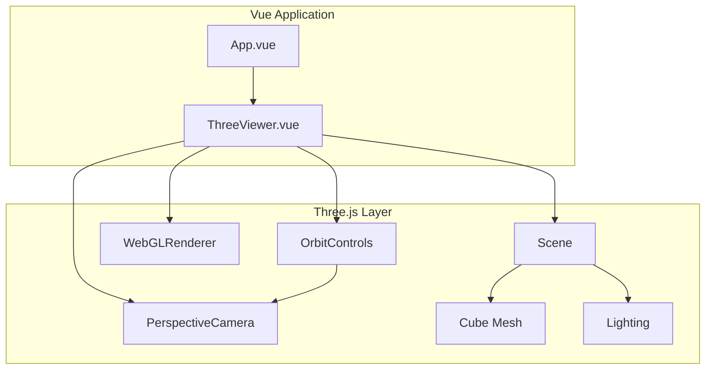

# 设计文档

## 概述

本设计文档描述了 3D 模型查看器的技术架构和实现方案。该应用基于 Vue 3 组合式 API 和 TypeScript 构建，使用 Three.js 进行 3D 渲染，Vite 作为开发和构建工具。

## 架构

### 整体架构



### 技术栈

| 技术 | 版本 | 用途 |
|------|------|------|
| Vue | 3.x | 前端框架 |
| TypeScript | 5.x | 类型安全 |
| Vite | 5.x | 构建工具 |
| Three.js | 0.160+ | 3D 渲染引擎 |

## 组件和接口

### 项目结构

```
project-root/
├── src/
│   ├── components/
│   │   └── ThreeViewer.vue    # 3D 查看器组件
│   ├── composables/
│   │   └── useThreeScene.ts   # Three.js 场景逻辑
│   ├── App.vue                # 根组件
│   ├── main.ts                # 入口文件
│   └── style.css              # 全局样式
├── index.html
├── package.json
├── tsconfig.json
├── vite.config.ts
└── README.md
```

### ThreeViewer 组件

主要的 3D 查看器 Vue 组件，负责：
- 创建和管理 canvas 容器
- 初始化 Three.js 场景
- 处理组件生命周期

```typescript
// ThreeViewer.vue 组件接口
interface ThreeViewerProps {
  // 当前版本无需外部 props
}

interface ThreeViewerEmits {
  // 当前版本无需外部事件
}
```

### useThreeScene Composable

封装 Three.js 场景逻辑的组合式函数：

```typescript
interface UseThreeSceneOptions {
  container: Ref<HTMLElement | null>
}

interface UseThreeSceneReturn {
  init: () => void
  dispose: () => void
}

function useThreeScene(options: UseThreeSceneOptions): UseThreeSceneReturn
```

### Three.js 核心对象配置

#### 场景配置
```typescript
interface SceneConfig {
  backgroundColor: number  // 背景颜色，默认 0x1a1a2e
}
```

#### 摄像机配置
```typescript
interface CameraConfig {
  fov: number           // 视场角，默认 75
  near: number          // 近裁剪面，默认 0.1
  far: number           // 远裁剪面，默认 1000
  position: {
    x: number           // 默认 0
    y: number           // 默认 0
    z: number           // 默认 5
  }
}
```

#### 渲染器配置
```typescript
interface RendererConfig {
  antialias: boolean    // 抗锯齿，默认 true
  pixelRatio: number    // 像素比，默认 window.devicePixelRatio
}
```

#### 控制器配置
```typescript
interface ControlsConfig {
  enableDamping: boolean    // 启用阻尼，默认 true
  dampingFactor: number     // 阻尼系数，默认 0.05
  minDistance: number       // 最小距离，默认 2
  maxDistance: number       // 最大距离，默认 20
  enablePan: boolean        // 启用平移，默认 true
}
```

#### 立方体配置
```typescript
interface CubeConfig {
  size: number              // 边长，默认 1
  color: number             // 颜色，默认 0x00d4ff
}
```

## 数据模型

### 场景状态

```typescript
interface SceneState {
  scene: THREE.Scene | null
  camera: THREE.PerspectiveCamera | null
  renderer: THREE.WebGLRenderer | null
  controls: OrbitControls | null
  cube: THREE.Mesh | null
  animationId: number | null
}
```

### 渲染循环

渲染循环使用 `requestAnimationFrame` 实现：

```typescript
function animate(): void {
  animationId = requestAnimationFrame(animate)
  controls.update()  // 更新控制器（阻尼效果需要）
  renderer.render(scene, camera)
}
```

## 正确性属性


*正确性属性是指在系统所有有效执行中都应保持为真的特征或行为——本质上是关于系统应该做什么的形式化陈述。属性作为人类可读规范和机器可验证正确性保证之间的桥梁。*

基于验收标准分析，以下是可测试的正确性属性：

### Property 1: 场景初始化完整性

*对于任何* ThreeViewer 组件实例，当组件挂载完成后，DOM 中应存在一个 canvas 元素，且 scene.children 中应包含至少一个 Mesh 类型的对象（立方体）。

**Validates: Requirements 2.1, 2.2**

### Property 2: 窗口调整响应

*对于任何* 窗口尺寸变化，renderer 的 canvas 尺寸应与新的窗口尺寸匹配，且 camera.aspect 应等于新的宽高比。

**Validates: Requirements 2.5**

### Property 3: 摄像机旋转控制

*对于任何* 左键拖拽操作，摄像机的球面坐标（相对于目标点）应发生变化，而摄像机到目标点的距离应保持不变。

**Validates: Requirements 3.1**

### Property 4: 摄像机缩放控制

*对于任何* 鼠标滚轮操作，摄像机到目标点的距离应发生变化，且变化方向与滚轮方向一致。

**Validates: Requirements 3.2**

### Property 5: 摄像机平移控制

*对于任何* 右键拖拽操作，OrbitControls 的目标点位置应发生变化，且摄像机位置应同步移动以保持相对关系。

**Validates: Requirements 3.3**

### Property 6: 缩放范围限制

*对于任何* 缩放操作，摄像机到目标点的距离应始终在 minDistance 和 maxDistance 之间（包含边界）。

**Validates: Requirements 3.5**

### Property 7: 光照系统完整性

*对于任何* 初始化完成的场景，scene.children 中应包含至少一个 Light 类型的对象，且立方体的材质应为支持光照的材质类型（如 MeshStandardMaterial 或 MeshPhongMaterial）。

**Validates: Requirements 4.1, 4.2**

## 错误处理

### WebGL 不支持

当浏览器不支持 WebGL 时：
- 检测 WebGL 支持情况
- 显示友好的错误提示信息
- 建议用户更新浏览器或启用硬件加速

### 组件卸载清理

当组件卸载时，必须正确清理资源：
- 取消 requestAnimationFrame
- 销毁 OrbitControls
- 释放 renderer 资源
- 移除事件监听器

```typescript
function dispose(): void {
  if (animationId !== null) {
    cancelAnimationFrame(animationId)
  }
  controls?.dispose()
  renderer?.dispose()
  window.removeEventListener('resize', handleResize)
}
```

### 容器元素不存在

当容器元素引用为 null 时：
- 在 init 函数开始时检查容器是否存在
- 如果不存在，提前返回并记录警告

## 测试策略

### 单元测试

使用 Vitest 进行单元测试：

1. **配置验证测试**
   - 验证 TypeScript strict 模式配置
   - 验证 Three.js 依赖安装
   - 验证 renderer antialias 配置

2. **组件挂载测试**
   - 验证 canvas 元素创建
   - 验证场景对象初始化

3. **资源清理测试**
   - 验证组件卸载时资源正确释放

### 属性测试

使用 fast-check 进行属性测试：

1. **Property 2: 窗口调整响应**
   - 生成随机窗口尺寸
   - 触发 resize 事件
   - 验证 canvas 和 camera 更新

2. **Property 6: 缩放范围限制**
   - 生成随机缩放操作序列
   - 验证距离始终在限制范围内

### 测试配置

```typescript
// vitest.config.ts
export default defineConfig({
  test: {
    environment: 'jsdom',
    globals: true,
    setupFiles: ['./src/test/setup.ts']
  }
})
```

属性测试应配置至少 100 次迭代，并使用以下标签格式：
**Feature: 3d-model-viewer, Property {number}: {property_text}**
